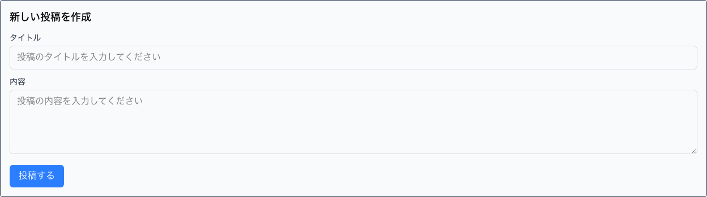

# 投稿掲示板アプリケーション 利用者ドキュメント

## 概要
このアプリケーションは、Nuxt 3とPostgreSQLを使用した投稿掲示板です。
ユーザーは投稿の作成、閲覧ができます。

## アクセス方法
アプリケーションURL: http://localhost:3000

## 利用可能な機能

### 2. 投稿作成フォーム
- **場所**: ページ上部
- **構成要素**:
  - **タイトル入力欄**: 投稿のタイトルを入力
  - **内容入力欄**: 投稿の本文を入力（複数行対応）
  - **投稿ボタン**: フォーム送信用




## 技術仕様
- **フロントエンド**: Nuxt 3, Vue.js, Tailwind CSS
- **バックエンド**: Nuxt Server API
- **データベース**: PostgreSQL
- **インフラ**: Docker, Docker Compose

## 開発環境の起動方法
```bash
# Docker環境を起動
docker-compose up -d

# または開発スクリプトを使用
./scripts/dev.sh start
```

## API エンドポイント
- `GET /api/posts` - 投稿一覧取得
- `POST /api/posts` - 新規投稿作成

## トラブルシューティング
1. **投稿が表示されない場合**:
   - データベース接続を確認してください
   - `docker-compose logs db`でデータベースのログを確認

2. **投稿作成に失敗する場合**:
   - タイトルと内容が入力されているか確認
   - ネットワーク接続を確認

## サポート
問題が発生した場合は、開発チームにお問い合わせください。

---
*このドキュメントは2025/7/22に自動生成されました。*
